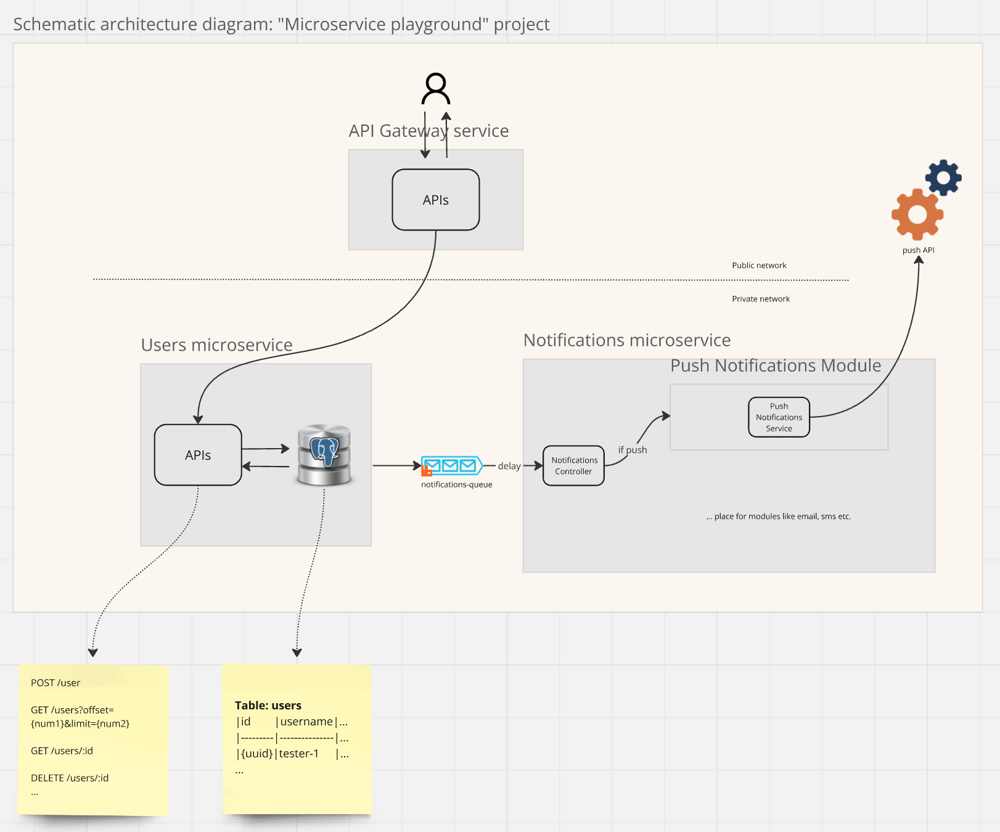

## Description
System of microservices for managing users and sending them push notifications.

## Technologies
- Nest.js
- PostgreSQL
- RabbitMQ + rabbitmq_delayed_message_exchange plugin
- Docker

## Schematic architecture diagram


## Setup
1. Clone the repository
2. Create a `.env` file in the root directory by following the `.env.example` file
3. Run `docker-compose up --build` in the root directory

## Testing

- View "pushes" according to current .env.example PUSH_WEBHOOK_URL:
  https://webhook.site/#!/view/5d9f6579-4f16-4e3d-b345-a5461b31bb07

- Create user
```
curl --location 'localhost:3000/users' \
--header 'Content-Type: application/json' \
--data '{
    "username": "test_user_1"
}'
```

- Get user by ID
```
curl --location 'localhost:3000/users/8f861263-3b8b-4a8a-a1b4-4efbacc85e39'
```

- Check API Gateway status
`curl --location 'localhost:3000/'`
